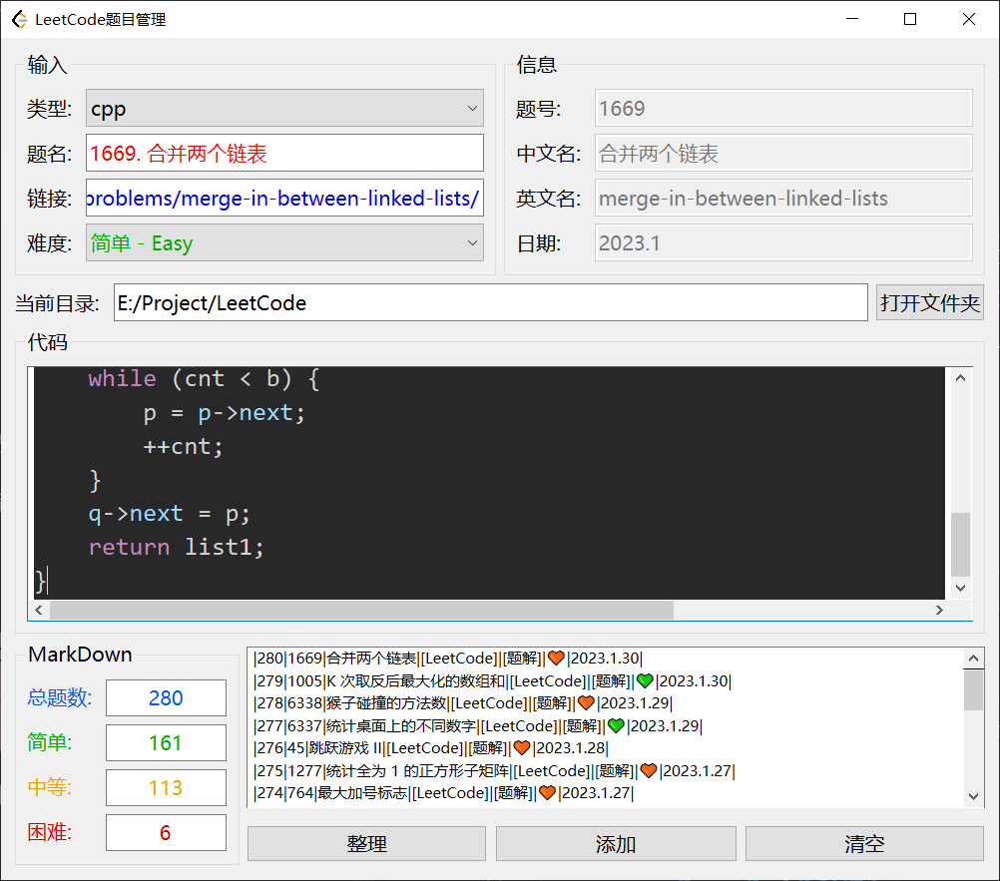

# LeetCodeAdministrator
#### LeetCode题目管理，依赖 [AkashiNeko](https://github.com/AkashiNeko/) 的 [LeetCode](https://github.com/AkashiNeko/LeetCode) 仓库

### 使用方法：

1. 克隆 [LeetCode](https://github.com/AkashiNeko/LeetCode) 仓库

~~~bash
git clone https://github.com/AkashiNeko/LeetCode.git
~~~

2. 将 [Release](https://github.com/AkashiNeko/LeetCodeAdministrator/releases) 置于克隆仓库的 `LeetCode` 目录下，如下。

3. 双击`LeetCode_x64`运行。
